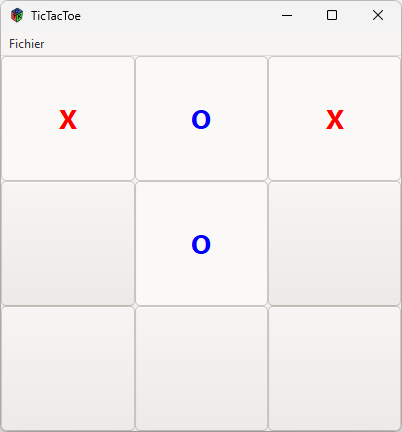

# Tic Tac Toe



## Ubuntu

```bash
sudo apt-get install libgtk-3-dev
gcc $(pkg-config --cflags gtk+-3.0) -o tictactoe main.c $(pkg-config --libs gtk+-3.0)
```

## Compilation avec Meson

```bash
meson setup build
ninja -C build
```

## Compilation avec Conan et Meson

```bash
conan install . -of build
meson setup build
```

## Windows

### MinGW

```cmd
winget install -e --id MSYS2.MSYS2
```

Vous pouvez soit configurer Windows Termianl pour utiliser le shell MSYS2 ou lancer le shell MSYS2. La première solution est préférable. Voici le profile à ajouter dans le fichier `settings.json` de Windows Terminal:

```json
{
    "colorScheme": "Campbell",
    "commandline": "\"C:\\\\msys64\\\\usr\\\\bin\\\\bash.exe\" --login -i -c \"cd ~ && /usr/bin/env MSYSTEM=MINGW64 bash\"\r",
    "guid": "{cffe7ad8-1ccd-43ea-99d9-d3dff62b8a02}",
    "hidden": false,
    "icon": "C:\\msys64\\mingw64.ico",
    "name": "MinGW",
    "startingDirectory": "~"
}
```

!!! info "Backslash"

    Remarquez l'embarassement de devoir échapper les backslashes dans le fichier JSON. Windows aurait pu se mettre à la page... Il y a 4 backslashes pour un seul backslash, pourquoi ?

    Le caractère backslash est un caractère d'échappement dans JSON. Il faut donc l'échapper lui-même. C'est pourquoi on a `\\` pour un seul backslash. Cependant le caractère d'échappement dans JSON est aussi le backslash. Il faut donc l'échapper lui-même. C'est pourquoi on a `\\\\` pour un seul backslash.

Une fois dans le terminal MSYS2, vous pouvez installer les outils nécessaires avec le gestionnaire de paquets `pacman`, eh oui encore un gestionnaire de paquets.

```cmd
pacman -Syu
pacman -S mingw-w64-x86_64-toolchain
pacman -S mingw-w64-x86_64-gtk3
```

Ensuite, il faut redémarrer le terminal pour que les changements soient pris en compte.

```cmd
gcc `pkg-config --cflags gtk+-3.0` -o tictactoe.exe main.c `pkg-config --libs gtk+-3.0`
```

Vous pouvez maintenant vous rendre dans le répertoire contenant l'exécutable et lancer le programme. Normalement vous devriez avoir une erreur :


Hélas, sous Windows, il n'a pas de gestion standardisée des emplacements des fichiers partagés. Il y a deux solutions pour résoudre ce problème:

1. Copier les DLLs dans le même répertoire que l'exécutable. C'est la solution la plus simple mais aussi la plus lourde.
2. Ajouter le répertoire contenant les DLLs dans le `PATH`. C'est la solution la plus propre mais aussi la plus complexe.

Pour ajouter le répertoire contenant les DLLs dans le `PATH`. Depuis le menu Démarrer choisissez exécuter puis tapez `sysdm.cpl`. Dans l'onglet Avancé, cliquez sur Variables d'environnement. Dans la section Variables système, sélectionnez la variable `Path` puis cliquez sur Modifier. Ajoutez le chemin vers le répertoire contenant les DLLs à la fin de la liste:  `C:\msys64\mingw64\bin`.

Vous pouvez maintenant lancer le programme.

!!! info "Console"

    Vous remarquerez que votre programme est lancé dans une console. C'est normal, c'est le comportement par défaut sous Windows. Pour éviter cela, vous pouvez ajouter l'option `-mwindows` à la commande de compilation.

Comment distribuer votre programme ? Il y a plusieurs solutions.

1. Distribuer les sources et de demander à l'utilisateur de les compiler lui-même.
2. Utiliser NSIS.
3. Utiliser WiX Toolset.


### NSIS

NSIS est un logiciel libre qui permet de créer des installateurs pour Windows. Il est utilisé par de nombreux projets comme VLC, GIMP, FileZilla, etc.


Vous pouvez l'installer avec `winget` depuis un terminal PowerShell:

```cmd
winget install -e --id NSIS.NSIS
```

Le programme se base sur un script pour créer l'installateur. Voici un exemple de script pour notre programme Tic Tac Toe:

```text
OutFile "TicTacToeInstaller.exe"
InstallDir $PROGRAMFILES\TicTacToe
Page directory
Page instfiles

Section
  SetOutPath $INSTDIR
  File "tictactoe.exe"
  CreateShortcut "$DESKTOP\TicTacToe.lnk" "$INSTDIR\tictactoe.exe"
SectionEnd
```

## Biblithèques Graphiques

### GTK

### SDL

https://github.com/yves-chevallier/tower-defence

https://github.com/dashed/tetris-sdl-c

https://github.com/olzhasar/sdl-tetris.git

On pourrait récupérer les glyphs https://github.com/johnmryan/TowerDefense

### Allegro

### Cairo

### OpenGL

### Raylib


### Jeux intéressants

https://github.com/Gregwar/ASCII-Tetris.git


https://github.com/oz123/awesome-c